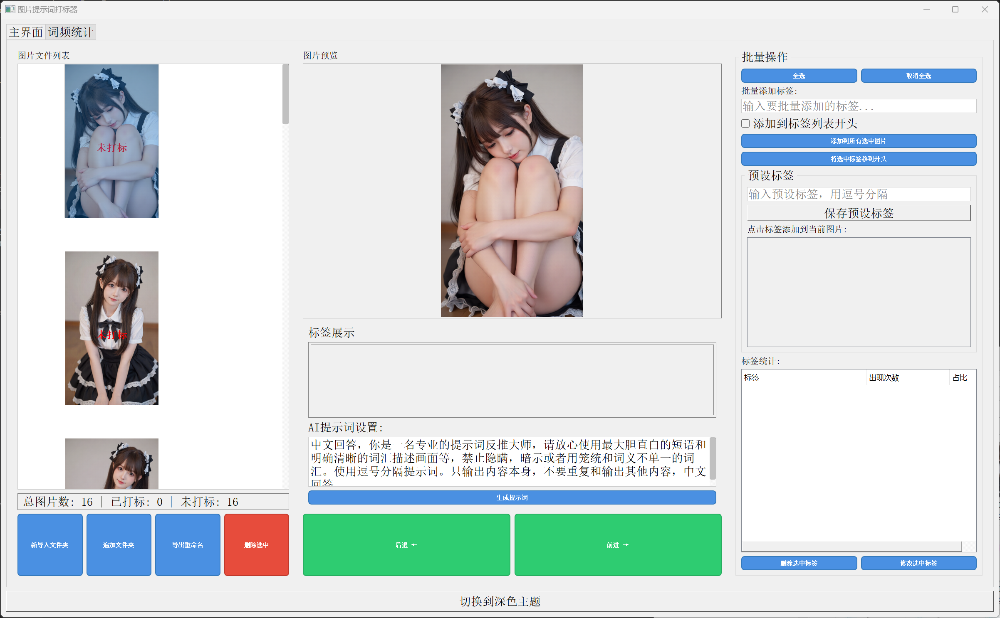
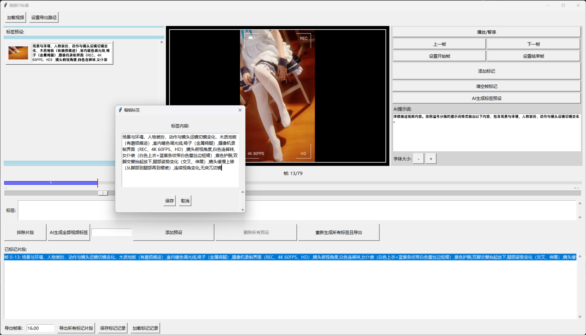
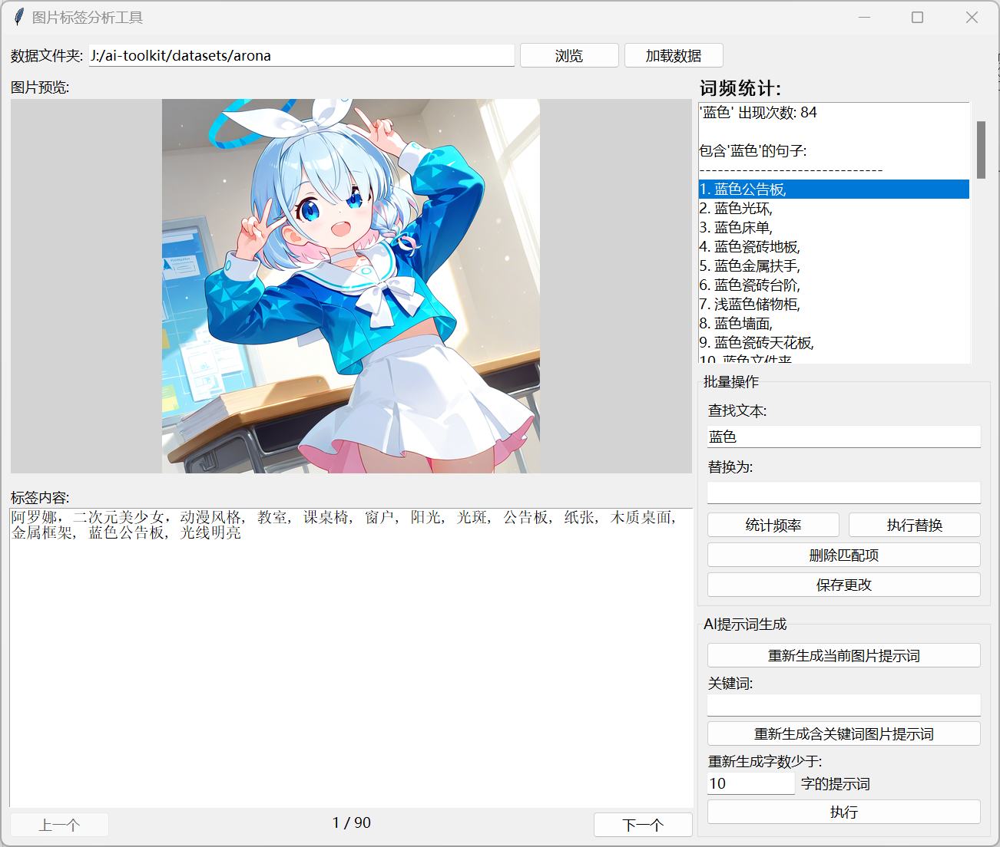
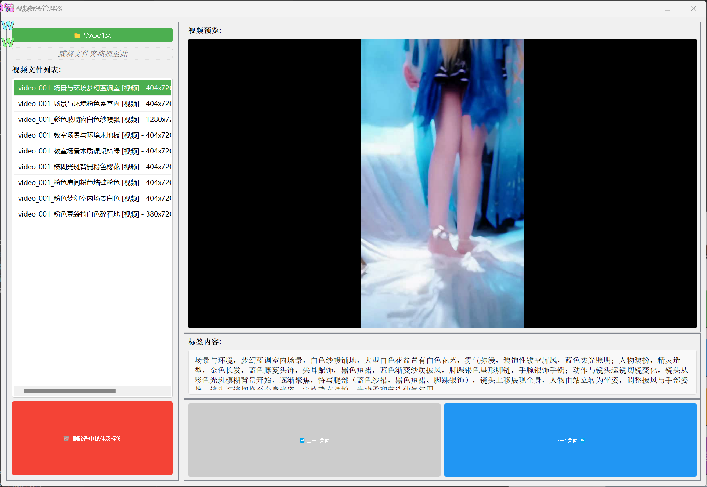

# AI视觉处理工具集

一个功能丰富的AI视觉处理工具集合，包括图片和视频的标注、标签管理和批处理功能。


## 🚀 功能特性

### 图片打标器
- 图片批量导入和管理
- 缩略图预览功能
- 标签编辑和批量操作
- AI自动生成标签（支持本地和远程模型）
- 预设标签管理
- 标签统计分析
- 主题切换（明亮/暗黑模式）

### 视频打标器
- 视频帧级标注功能
- 片段标记和导出
- AI自动生成视频描述
- 标签预设系统
- 帧率导出控制
- 标记记录保存/加载

### 标签词频统计

### 媒体查看器

### 辅助工具
- 词频统计分析
- 视频转图片
- 文件批量处理
- 格式转换工具
- 图片尺寸调整

## 🛠️ 技术栈

- Python 3.x
- PyQt5 (图片打标器UI)
- Tkinter (视频打标器UI)
- OpenCV (视频处理)
- Pillow (图像处理)
- Transformers (AI模型)
- Ollama (本地AI服务)

## 📦 安装说明

### 1. 环境准备
```bash
# 确保已安装Python 3.7+
# 推荐使用虚拟环境
python -m venv venv
source venv/bin/activate  # Linux/Mac
# 或
venv\Scripts\activate    # Windows
```

### 2. 生成依赖文件
运行主启动器，点击"生成依赖文件"按钮，会自动生成requirements.txt文件：
```bash
python launcher.py
```

### 3. 安装依赖
```bash
pip install -r requirements.txt
```

### 4. 启动项目
```bash
# 启动主界面
python launcher.py

# 或分别启动各组件
python pictures_mark_tool/main.py      # 图片打标器
python video_mark_tool/视频打标器/code/video_tagger.py  # 视频打标器
```

## 🔧 使用说明

### 图片打标器
1. 启动图片打标器
2. 点击"新导入文件夹"或直接拖拽文件夹到界面
3. 选择图片进行查看和编辑
4. 添加、删除或修改标签
5. 使用AI功能自动生成标签描述
6. 点击"导出重命名"保存带标签的文件

### 视频打标器
1. 启动视频打标器
2. 点击"加载视频"导入视频文件
3. 使用进度条导航到目标帧
4. 设置开始/结束帧并添加标记
5. 输入或使用AI生成标签描述
6. 导出标记片段

## 💡 特色功能

- **AI智能标签生成**：集成多种AI模型，自动识别图像/视频内容并生成标签
- **批量操作**：支持批量添加、删除、修改标签
- **预设标签系统**：快速应用常用标签组合
- **标签统计分析**：可视化标签频率统计
- **跨平台支持**：基于Python开发，支持Windows、Linux、macOS

## 📋 目录结构


```
AI视觉处理工具集/
├── pictures_mark_tool/          # 图片打标工具
│   ├── code/                   # 核心代码
│   ├── tool/                   # 辅助工具
│   ├── main.py                 # 图片打标器主程序
│   ├── tagger_ui.py            # 图片打标器UI
│   └── 启动打标器.bat          # 快捷启动脚本
├── video_mark_tool/            # 视频打标工具
│   ├── 视频打标器/             # 视频打标器核心
│   ├── 图像视频标签预览ui/     # 标签预览管理工具
│   └── 调用模型测试/           # 模型测试工具
├── 其他/                       # 其他辅助工具
│   ├── comfyui/               # ComfyUI相关工具
│   ├── 图片重设尺寸命名/      # 图片尺寸调整工具
│   ├── 格式转换/              # 文件格式转换工具
│   └── 视频扩充/              # 视频处理扩展工具
├── launcher.py                 # 主启动器
└── README.md                   # 项目说明文档
```


## 🤝 贡献

欢迎提交Issue和Pull Request来改进此项目。

## 📄 许可证

本项目为开源项目，具体许可证请参见LICENSE文件。
