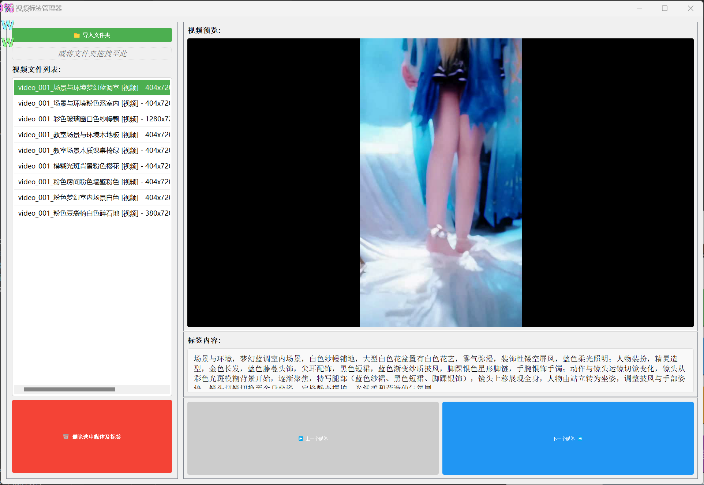

# AI 视觉处理工具集

一个功能丰富的 AI 视觉处理工具集合，包括图片和视频的标注、标签管理、批处理和 AI 视频生成功能。

[](https://www.python.org/)
[](LICENSE)

---

## 🚀 功能特性

### 📸 图片打标器 (pictures_mark_tool)
**基于 PyQt5 的桌面应用，提供完整的图片标注解决方案：**

- **批量导入与管理**：支持文件夹拖拽导入，自动递归扫描图片资源
- **缩略图预览**：网格视图浏览图片，点击查看大图详情
- **标签编辑**：支持添加、删除、修改标签，逗号分隔的批量输入
- **AI 自动生成标签**：
  - 集成 Ollama 本地 AI 模型（支持离线运行）
  - 支持远程 API 调用
  - 可配置提示词模板
- **预设标签系统**：快速应用常用标签组合，提高标注效率
- **标签统计分析**：可视化展示标签频率分布
- **批量操作**：一键导出并重命名文件，自动添加标签信息
- **主题切换**：支持明亮/暗黑模式切换


### 🎥 视频打标器 (video_mark_tool/视频打标器)
**基于 Tkinter 的视频帧级标注工具：**

- **帧级标注**：精确控制视频每一帧的标签标注
- **片段标记与导出**：选择视频片段范围，导出带标签的视频片段
- **AI 自动生成描述**：结合本地 AI 模型生成视频内容描述
- **标签预设系统**：快速应用预定义标签模板
- **帧率导出控制**：支持自定义输出视频帧率
- **标记记录管理**：保存/加载标注进度，支持中断后继续


### 📊 标签词频统计 (pictures_mark_tool/tool/词频统计)
**数据可视化分析工具：**

- 自动扫描文件夹中的所有标签文件
- 统计各标签出现频率
- 生成可视化词云图
- 支持导出统计报告


### 🖼️ 媒体查看器 (pictures_mark_tool/tool)
**快速预览工具：**

- 批量图片预览
- 视频缩略图展示
- 快速浏览标注结果



### 🌐 Web UI - Wan2.2 首尾帧视频生成器 (web_ui)
**基于 Streamlit 的交互式 AI 视频生成工具：**

- **首尾帧插值生成**：上传起始和结束帧图像，AI 自动生成中间过渡视频
- **ComfyUI 集成**：直接调用本地 ComfyUI 服务执行复杂工作流
- **可配置参数**：
  - 采样步数控制（高噪/低噪阶段）
  - UNet/CLIP/VAE 模型选择
  - LoRA 微调模块配置（运镜效果）
  - 视频输出参数（帧率、比特率、文件名前缀）
- **实时连接测试**：一键检测 ComfyUI 服务状态
- **进度可视化**：实时监控生成进度和状态
- **结果下载**：支持直接下载生成的视频文件


### 🛠️ 辅助工具 (其他/)

#### ComfyUI 相关工具
| 工具 | 功能描述 |
|------|----------|
| 批量动漫转写实 | 一键批量转换图片风格 |
| 视频插帧 | 提升视频流畅度 |
| 视频放大 | 超分辨率增强视频画质 |
| 工作流模板 | 预配置的视频生成工作流 JSON |

#### 格式转换工具 (其他/格式转换/)
- **图片转视频**：将序列图片合成为视频
- **音乐处理**：音频文件转换与编辑
- **通用格式转换**：支持多种媒体格式互转

#### 图片处理工具 (其他/图片重设尺寸命名/)
- **批量缩放**：统一调整图片尺寸
- **智能重命名**：按规则批量重命名文件
- **合并操作**：多文件夹内容整合

#### 视频扩展工具 (其他/视频扩充/)
- **时长延长**：自动扩展视频播放时间
- **帧率调整**：提升或降低视频流畅度

#### 文件处理工具 (其他/文件处理/)
- **配对工具**：文件配对与关联管理
- **标签提取**：从文件中批量提取标签信息
- **标签过滤 UI**：可视化标签筛选与管理
- **文件夹通用处理**：批量文件操作脚本

---

## 🛠️ 技术栈

| 技术 | 用途 |
|------|------|
| Python 3.8+ | 编程语言 |
| PyQt5 | 图片打标器桌面 UI |
| Tkinter | 视频打标器桌面 UI |
| Streamlit | Web UI 界面 |
| OpenCV | 视频处理核心 |
| Pillow | 图像处理库 |
| Transformers | AI 模型推理 |
| Ollama | 本地 AI 服务集成 |
| ComfyUI API | 工作流执行引擎 |
| websocket-client | 实时通信 |

---

## 📦 安装说明

### 1. 环境准备

```bash
# 确保已安装 Python 3.8+
# 推荐使用虚拟环境
python -m venv venv

# Linux/Mac
source venv/bin/activate

# Windows
venv\Scripts\activate
```

### 2. 安装基础依赖

```bash
pip install -r requirements.txt
```

### 3. ComfyUI 服务要求 (Web UI 功能需要)

**确保已安装以下 ComfyUI 自定义节点：**
- `VHS_VideoManager`: 视频输出管理
- `Wan2.2 Custom Nodes`: Wan2.2 模型专用节点

**启动 ComfyUI 服务：**
```bash
cd /path/to/ComfyUI
python main.py --listen 127.0.0.1:8188
```

### 4. Ollama 本地 AI (可选)

```bash
# Linux/Mac
curl -fsSL https://ollama.com/install.sh | sh

# Windows
# 下载 https://ollama.com/download/windows

# 拉取语言模型
ollama pull llama3
```

---

## 🚀 快速开始

### 最简单的方式

| 功能 | 启动方式 |
|------|----------|
| 图片打标 | 双击 `pictures_mark_tool/启动打标器.bat` |
| 视频打标 | 双击主目录 `启动打标器.bat` |
| Web UI | `cd web_ui && python run_app.py` |

### 命令行启动

```bash
# 启动主界面（带菜单）
python launcher.py

# 分别启动各组件
python pictures_mark_tool/main.py                    # 图片打标器
python "video_mark_tool/视频打标器/code/video_tagger.py"  # 视频打标器
cd web_ui && python run_app.py                       # Web UI (需 ComfyUI 服务运行)
```

---

## 🔧 使用说明

### 📸 图片打标器操作指南

1. **启动程序**：双击 `.bat` 文件或运行 `python pictures_mark_tool/main.py`
2. **导入资源**：点击"新导入文件夹"或直接拖拽文件夹到界面
3. **浏览图片**：在网格视图中点击图片查看详情
4. **编辑标签**：在输入框编辑标签（支持逗号分隔批量添加）
5. **AI 生成**：点击"AI 生成标签"自动分析图片内容
6. **查看统计**：右侧面板显示标签频率分布
7. **导出结果**：完成标注后点击"导出重命名"保存

### 🎥 视频打标器操作指南

1. **启动程序**：运行 `python "video_mark_tool/视频打标器/code/video_tagger.py"`
2. **加载视频**：点击"加载视频"导入目标文件
3. **导航定位**：使用进度条跳转到目标帧
4. **设置范围**：设定片段起始帧和结束帧
5. **添加标记**：输入标签或使用 AI 生成，点击"添加标记"保存
6. **导出结果**：完成标注后导出视频片段

### 🌐 Web UI - Wan2.2 视频生成操作指南

1. **启动服务**：确保 ComfyUI 运行在 `http://127.0.0.1:8188`
2. **打开界面**：访问 `http://localhost:8501`
3. **连接测试**：点击"测试 ComfyUI 连接"验证服务状态
4. **上传图片**：上传首帧和尾帧图像
5. **配置提示词**：填写正向/负向提示词描述视频内容
6. **调整参数**：根据需要修改采样步数、种子、模型等
7. **开始生成**：点击"生成视频"按钮
8. **获取结果**：等待完成后下载生成的视频

---

## 💡 特色功能

### 🤖 AI 智能标签生成
- **多模型支持**：集成 Ollama 本地模型和远程 API
- **离线可用**：本地部署后可完全脱离网络使用
- **可定制提示词**：根据具体场景调整 AI 生成策略

### 🔁 批量操作自动化
- **一键导出**：自动为所有标注文件添加标签信息并重命名
- **文件夹扫描**：递归处理子目录中的所有媒体文件
- **进度追踪**：实时显示处理进度和统计信息

### 📈 预设标签系统
- **快速应用**：常用标签组合一键应用
- **自定义模板**：根据项目需求创建专属标签库
- **分类管理**：支持按类别组织和管理标签

### 📊 可视化统计分析
- **词云展示**：直观呈现热门标签分布
- **频率图表**：柱状图分析标签使用频次
- **导出报告**：生成可分享的统计文档

### 🔗 ComfyUI 工作流集成
- **可视化编排**：通过 JSON 配置复杂生成流程
- **参数动态注入**：Web UI 实时调整工作流参数
- **实时反馈**：WebSocket 连接实现任务状态同步

---

## 📋 目录结构

```
Ai_visual_processing_tools/
├── pictures_mark_tool/              # 图片打标工具（PyQt5）
│   ├── code/                       # 核心代码模块
│   │   ├── ai_caption_generator.py    # AI 标签生成器
│   │   ├── batch_operations.py        # 批量操作处理
│   │   ├── file_operations.py         # 文件读写工具
│   │   ├── ollama_caption_generator.py# Ollama 模型集成
│   │   ├── preset_tags.py             # 预设标签管理
│   │   ├── statistics.py              # 统计分析模块
│   │   ├── tag_management.py          # 标签管理系统
│   │   └── ui_event_handlers.py       # UI 事件处理
│   ├── tool/                        # 辅助工具集
│   │   └── 词频统计/                    # 词云分析工具
│   ├── main.py                     # 主程序入口
│   ├── tagger_ui.py                # 界面逻辑
│   └── 启动打标器.bat                 # Windows 快捷启动
│
├── video_mark_tool/                 # 视频打标工具（Tkinter）
│   ├── 视频打标器/                     # 核心标注程序
│   │   ├── code/
│   │   │   ├── ai_features.py         # AI 功能集成
│   │   │   ├── tag_management.py      # 标签管理
│   │   │   ├── video_tagger.py        # 主程序
│   │   │   ├── video_processing.py    # 视频处理核心
│   │   │   └── video_clipper.py       # 片段裁剪工具
│   │   └── config.ini               # 配置文件
│   ├── 图像视频标签预览 ui/            # 标签管理工具
│   ├── 拆分视频工具/                  # 视频分割助手
│   └── 视频图片标签多文件夹合并为 1 工具/ # 数据整合工具
│
├── web_ui/                          # Web UI（Streamlit）
│   ├── wan22_i2v_app.py            # Wan2.2首尾帧生成器
│   └── run_app.py                   # 启动脚本
│
├── 其他/                            # 辅助工具集
│   ├── comfyui/                    # ComfyUI工作流模板
│   │   ├── 插帧.py                  # 视频插帧脚本
│   │   ├── batch_anime2real.py     # 批量风格转换
│   │   └── *.json                   # 工作流配置文件
│   ├── 格式转换/                    # 媒体格式转换
│   │   ├── 图片转视频.py              # 序列图合成视频
│   │   └── transform.py             # 通用转换器
│   ├── 图片重设尺寸命名/              # 图片批量处理
│   │   └── pictures_resize.py       # 缩放与重命名
│   ├── 视频扩充/                     # 视频扩展工具
│   │   └── 扩充视频时长.py             # 时长延长
│   └── 文件处理/                     # 通用文件操作
│       ├── 数据集标签提取.py          # 标签抽取脚本
│       └── 图片视频标签过滤 ui.py     # 可视化过滤工具
│
├── output/                          # 输出结果目录（自动生成）
├── uploads/                         # 上传临时目录（Web UI）
├── launcher.py                      # 主启动器（图形化菜单）
├── main.py                          # 程序入口点
├── requirements.txt                 # Python依赖列表
└── README.md                        # 项目说明文档
```

---

## 🤝 贡献

欢迎提交 Issue 和 Pull Request 来改进此项目！

### 如何贡献
1. Fork 本仓库
2. 创建特性分支 (`git checkout -b feature/AmazingFeature`)
3. 提交更改 (`git commit -m 'Add some AmazingFeature'`)
4. 推送到分支 (`git push origin feature/AmazingFeature`)
5. 开启 Pull Request

---

## 📄 许可证

MIT License - 详见 [LICENSE](LICENSE) 文件

---

## 📮 联系方式

如有问题或建议，请通过以下方式联系：
- GitHub Issues: 提交问题报告
- Email: [your-email@example.com]

---

<div align="center">

**⭐ 如果这个项目对你有帮助，请给一个 Star！⭐**

</div>
