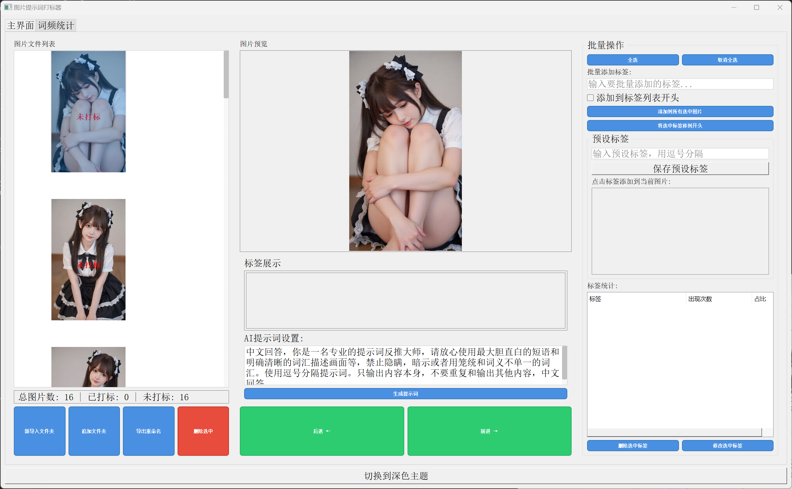
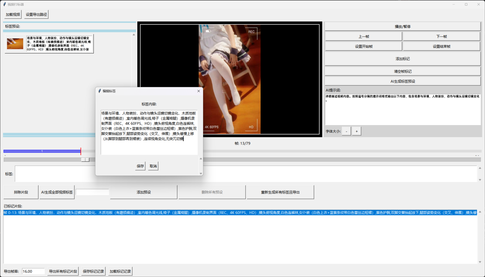
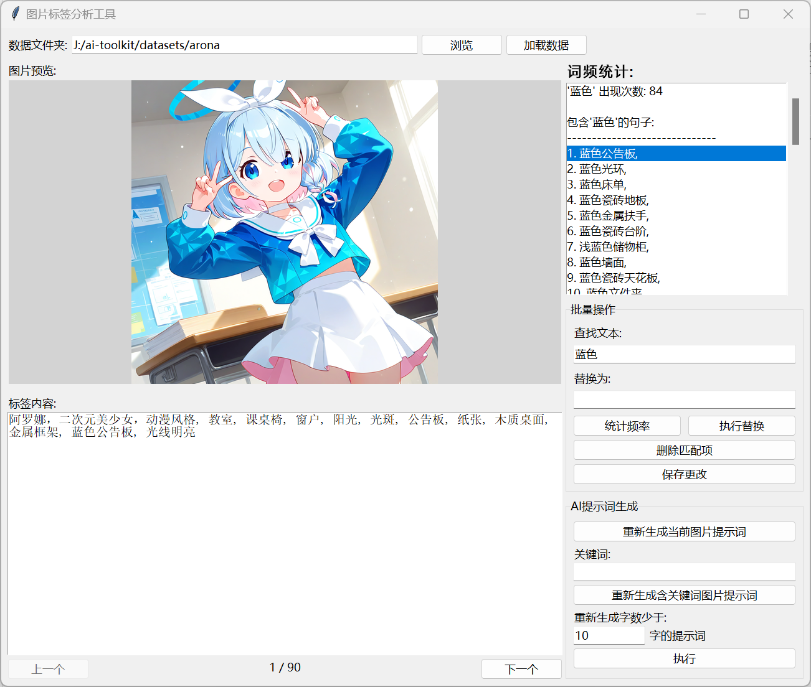

# AI 视觉处理工具集

一个功能丰富的 AI 视觉处理工具集合，集成图片/视频标注、AI 标签生成、ComfyUI 工作流自动化、媒体批量处理等核心功能，为视觉数据处理提供一站式解决方案。

[](https://www.python.org/)
[](LICENSE)
[](https://www.microsoft.com/windows)

---

## 目录

- [功能特性](#-功能特性)
- [快速开始](#-快速开始)
- [安装说明](#-安装说明)
- [核心模块详解](#-核心模块详解)
- [辅助工具集](#-辅助工具集)
- [技术栈](#-技术栈)
- [项目结构](#-项目结构)
- [配置说明](#-配置说明)
- [常见问题](#-常见问题)
- [贡献](#-贡献)

---

## 🚀 功能特性

### 核心功能总览

| 模块 | 功能描述 | 界面类型 |
|------|----------|----------|
| 📸 图片打标器 | 图片批量标注、AI 标签生成、标签统计 | PyQt5 桌面应用 |
| 🎥 视频打标器 | 帧级视频标注、片段导出、AI 描述生成 | Tkinter 桌面应用 |
| 🌐 ComfyUI Web UI | Wan2.2 首尾帧视频生成、图像编辑 | Streamlit Web 应用 |
| 📊 词频统计 | 标签频率分析、词云可视化 | 独立工具 |
| 🔧 配对工具 | 文件配对管理、1:1 裁剪导出 | Tkinter 桌面应用 |

---

## 🏃 快速开始

### 一键启动（Windows）

```bash
# 启动统一工具集界面（推荐）
双击 启动工具集.bat

# 或启动原有主控制菜单
双击 启动打标器.bat
```

### 命令行启动

```bash
# 统一工具集界面（推荐）
python toolkit_launcher.py

# 原有主启动器（图形化菜单）
python launcher.py

# 分别启动各核心模块
python pictures_mark_tool/main.py                           # 图片打标器
python "video_mark_tool/视频打标器/code/video_tagger.py"    # 视频打标器
python "其他/文件处理/配对工具/main.py"                     # 配对工具
```

---

## 📦 安装说明

### 1. 环境要求

- **操作系统**: Windows 10/11
- **Python**: 3.10 或更高版本
- **显存**: 建议 8GB+（使用 AI 功能时）

### 2. 安装依赖

```bash
# 创建虚拟环境（推荐）
python -m venv .venv
.venv\Scripts\activate

# 安装核心依赖
pip install -r requirements.txt
```

### 3. 可选组件安装

#### Ollama 本地 AI（离线标签生成）

```bash
# 下载安装 Ollama
# https://ollama.com/download

# 拉取视觉语言模型
ollama pull qwen3-vl:30b

# 验证服务
ollama list
```

#### ComfyUI（视频生成功能）

```bash
# 1. 安装 ComfyUI
git clone https://github.com/comfyanonymous/ComfyUI.git

# 2. 安装必要自定义节点
cd ComfyUI/custom_nodes
git clone https://github.com/Kosinkadink/ComfyUI-VideoHelperSuite.git    # VHS_VideoManager
git clone https://github.com/kijai/ComfyUI-WanVideoWrapper.git           # Wan2.2 节点
```

---

## 📸 核心模块详解

### 图片打标器 (pictures_mark_tool)

基于 PyQt5 的专业级图片标注工具，支持批量导入、AI 自动生成标签、标签统计等功能。



#### 功能特性

| 功能分类 | 具体功能 |
|----------|----------|
| **导入管理** | 文件夹拖拽导入、递归扫描子目录、文件列表网格视图 |
| **标签编辑** | 单张/批量编辑、逗号分隔批量输入、标签快速应用 |
| **AI 生成** | Ollama 本地模型集成、远程 API 支持、可配置提示词模板 |
| **标签管理** | 预设标签组、标签频率统计、标签排序调整 |
| **批量操作** | 一键导出重命名、带标签信息写入、文件删除 |
| **界面主题** | 明亮/暗黑模式切换、自定义配色方案 |

#### 操作指南

1. **导入图片**: 点击「新导入文件夹」或直接拖拽文件夹到界面
2. **选择图片**: 单击选择单张，Ctrl+ 点击多选
3. **编辑标签**: 在输入框输入标签（逗号分隔多个标签）
4. **AI 生成**: 点击「AI 生成标签」按钮自动分析图片内容
5. **应用预设**: 从预设标签面板快速应用常用标签组合
6. **导出结果**: 完成标注后点击「导出重命名」保存

#### 配置文件

编辑 `pictures_mark_tool/code/config.ini`:

```ini
[OLLAMA]
api_base_url = http://127.0.0.1:11434/v1
api_key = ollama
model_name = qwen3-vl:30b

[FILTER_WORDS]
words = 模糊，重复，无关词
```

---

### 视频打标器 (video_mark_tool)

基于 Tkinter 的视频帧级标注工具，支持精确到帧的标签标注和视频片段导出。



#### 功能特性

| 功能分类 | 具体功能 |
|----------|----------|
| **帧级控制** | 精确帧导航、播放/暂停、进度条跳转 |
| **片段标记** | 起始帧/结束帧设定、多片段管理、排除片段 |
| **AI 描述** | 基于 AI 模型的视频内容描述生成 |
| **标签预设** | 快速应用预定义标签模板 |
| **导出控制** | 自定义输出帧率、选择导出片段 |
| **进度保存** | 标记记录保存/加载、支持中断续标 |

#### 操作指南

1. **加载视频**: 点击「加载视频」导入目标文件
2. **导航定位**: 使用进度条或方向键跳转到目标帧
3. **设置范围**: 设定片段起始帧和结束帧
4. **添加标签**: 输入标签或使用 AI 生成，点击「添加标记」
5. **管理标记**: 在标记列表中查看/编辑/删除已有标记
6. **导出视频**: 完成标注后选择片段导出

---

### 配对工具 (其他/文件处理/配对工具)

双面板文件配对管理工具，支持拖拽导入、配对关联、1:1 裁剪导出。

#### 功能特性

| 功能 | 描述 |
|------|------|
| **双面板布局** | 左右面板分别加载文件，直观对比 |
| **拖拽导入** | 支持文件夹/文件直接拖拽 |
| **智能配对** | 自动/手动配对模式 |
| **关联管理** | 配对关系可视化、支持取消配对 |
| **导出功能** | 1:1 裁剪导出、保留配对信息 |
| **主题切换** | 明亮/暗黑主题切换 |

#### 操作指南

1. **导入文件**: 拖拽文件夹到左右面板
2. **建立配对**: 自动配对或手动拖拽关联
3. **调整顺序**: 拖拽调整配对顺序
4. **导出结果**: 选择导出选项执行批量处理

---

### ComfyUI Web UI (其他/comfyui/web_ui)

基于 Streamlit 的 AI 视频生成工作台，集成 Wan2.2 首尾帧插值、图像编辑等功能。


#### 功能模块

| 模块 | 功能描述 |
|------|----------|
| **wan22_i2v_app.py** | Wan2.2 首尾帧视频生成器 |
| **qwen_edit_multimode_app.py** | 通义千问图像编辑工具 |
| **集成工作台.py** | 多模型集成工作流管理 |
| **数字人视频拼接 UI** | 数字人视频拼接工具 |

#### Wan2.2 视频生成操作

1. **启动 ComfyUI**: 确保服务运行在 `http://127.0.0.1:8188`
2. **启动 Web UI**: `python 其他/comfyui/web_ui/run_app.py`
3. **访问界面**: 打开浏览器访问 `http://localhost:8501`
4. **连接测试**: 点击「测试 ComfyUI 连接」验证状态
5. **上传图片**: 上传首帧和尾帧图像
6. **配置参数**:
   - 采样步数（高噪/低噪阶段）
   - UNet/CLIP/VAE 模型选择
   - LoRA 微调模块（运镜效果）
   - 输出帧率、比特率、文件名前缀
7. **开始生成**: 点击「生成视频」按钮
8. **获取结果**: 等待完成后下载

#### 支持的工作流

- 首尾帧插值生成
- 真人转动漫风格
- 批量动漫转写实
- 视频插帧增强
- 视频超分辨率放大

---

### 词频统计 (pictures_mark_tool/tool/词频统计)

标签数据分析可视化工具，自动生成标签频率统计和词云图。



#### 功能

- 自动扫描文件夹中的所有标签文件
- 统计各标签出现频率
- 生成可视化柱状图和饼图
- 支持导出统计报告（PNG/CSV）

---

## 🛠️ 辅助工具集

### 📋 统一工具集界面

**`toolkit_launcher.py`** - 全新集成启动器，将所有带 UI 的工具整合在一个界面中。

#### 工具分类

| 分类 | 工具数量 | 包含工具 |
|------|----------|----------|
| 🖼️ 图片打标工具 | 2 | 图片打标器、词频统计工具 |
| 🎬 视频打标工具 | 1 | 视频打标器 |
| 📁 文件处理工具 | 4 | 标签管理器、批处理工具、配对工具、数据集标签提取 |
| 🎞️ 格式转换工具 | 2 | 图片转视频、全能转换器 |
| 🎨 ComfyUI 工具 | 4 | 动漫转写实、真人转动漫、插帧、提示词提取 |
| 🔊 TTS 工具 | 1 | Gradio TTS 适配器 |

#### 界面特点

- **深色主题设计** - 现代化蓝黑色调配色
- **卡片式布局** - 每个工具显示图标、名称、描述和启动按钮
- **分类展示** - 按功能分类组织工具
- **可滚动界面** - 支持鼠标滚轮滚动浏览
- **悬停效果** - 卡片和按钮有交互反馈

---

### 格式转换工具 (其他/格式转换)

| 工具 | 功能 |
|------|------|
| 图片转视频.py | 序列图片合成为视频（支持自定义帧率） |
| transform.py | 通用媒体格式转换器 |
| music_kmg.py | 音频文件处理工具 |

### 图片处理工具 (其他/图片重设尺寸命名)

| 工具 | 功能 |
|------|------|
| pictures_resize.py | 批量缩放图片尺寸 |
| 智能重命名 | 按规则批量重命名文件 |
| 合并工具 | 多文件夹内容整合 |

### 视频扩展工具 (其他/视频扩充)

| 工具 | 功能 |
|------|------|
| 扩充视频时长.py | 自动延长视频播放时间 |
| 帧率调整 | 提升或降低视频流畅度 |

### ComfyUI 工具 (其他/comfyui)

| 工具 | 功能 |
|------|------|
| batch_anime2real.py | 批量动漫转写实风格 |
| 插帧.py | 视频插帧流畅度提升 |
| 提示词提取.py | 从图像提取 AI 提示词 |
| wan22 放大.py | Wan2.2 视频超分放大 |
| 真人转动漫.py | 真人视频转动漫风格 |

### 文件处理工具 (其他/文件处理)

| 工具 | 功能 |
|------|------|
| 数据集标签提取.py | 从标注文件批量提取标签 |
| 图片视频标签过滤 ui.py | 可视化标签筛选与管理 |
| 配对工具 | 文件配对与关联管理 |
| 文件夹通用处理_GUI.py | 批量文件操作图形界面 |
| txt 改逗号.py | 标签格式转换工具 |

---

## 🔧 技术栈

### 核心框架

| 技术 | 用途 | 版本 |
|------|------|------|
| Python | 编程语言 | 3.10+ |
| PyQt5 | 图片打标器 UI | 5.15+ |
| Tkinter | 视频打标器/配对工具 UI | 内置 |
| Streamlit | Web UI 界面 | 1.30+ |

### AI/ML 库

| 技术 | 用途 |
|------|------|
| Transformers | HuggingFace 模型推理 |
| Ollama | 本地 AI 服务集成 |
| OpenAI API | 远程 AI 服务调用 |
| Torch/Torchvision | 深度学习框架 |
| OpenCV | 计算机视觉处理 |

### 媒体处理

| 技术 | 用途 |
|------|------|
| OpenCV | 视频编解码、图像处理 |
| Pillow | 图像格式转换、缩略图生成 |
| FFmpeg (av) | 音视频处理 |
| Albumentations | 图像增强 |

### 其他依赖

| 技术 | 用途 |
|------|------|
| websocket-client | ComfyUI 实时通信 |
| Requests | HTTP API 调用 |
| Pandas | 数据统计分析 |
| Matplotlib | 数据可视化 |

---

## 📁 项目结构

```
Ai_visual_processing_tools/
├── pictures_mark_tool/                 # 图片打标器（PyQt5）
│   ├── code/                           # 核心代码模块
│   │   ├── ai_caption_generator.py     # AI 标签生成器（OpenAI/Ollama）
│   │   ├── ollama_caption_generator.py # Ollama 模型集成
│   │   ├── batch_operations.py         # 批量操作处理
│   │   ├── file_operations.py          # 文件读写工具
│   │   ├── preset_tags.py              # 预设标签管理
│   │   ├── statistics.py               # 统计分析模块
│   │   ├── tag_management.py           # 标签管理系统
│   │   ├── ui_event_handlers.py        # UI 事件处理
│   │   └── shuffle_files.py            # 文件打乱重命名
│   ├── tool/                           # 辅助工具
│   │   └── 词频统计/词频统计.py          # 词云分析工具
│   ├── main.py                         # 主程序入口
│   ├── tagger_ui.py                    # 界面逻辑
│   ├── image_processor.py              # 图像处理核心
│   ├── styles.py                       # 样式配置
│   └── 启动打标器.bat                   # Windows 快捷启动
│
├── video_mark_tool/                    # 视频打标器（Tkinter）
│   ├── 视频打标器/
│   │   ├── code/
│   │   │   ├── video_tagger.py         # 主程序
│   │   │   ├── video_processing.py     # 视频处理核心
│   │   │   ├── video_clipper.py        # 片段裁剪工具
│   │   │   ├── tag_management.py       # 标签管理
│   │   │   ├── ai_features.py          # AI 功能集成
│   │   │   ├── presets.py              # 预设配置
│   │   │   ├── ui_events.py            # UI 事件
│   │   │   └── utils.py                # 工具函数
│   │   └── config.ini                  # 配置文件
│   ├── 拆分视频工具/
│   │   └── 通用拆分视频.py
│   └── 批量修改帧率.py
│
├── 其他/                               # 辅助工具集
│   ├── comfyui/                        # ComfyUI 工作流与脚本
│   │   ├── batch_anime2real.py         # 批量动漫转写实
│   │   ├── 插帧.py                     # 视频插帧脚本
│   │   ├── 提示词提取.py               # 提示词提取
│   │   ├── 真人转动漫.py               # 真人转动漫
│   │   ├── wan22 放大.py               # Wan2.2 超分放大
│   │   └── web_ui/                     # Streamlit Web 应用
│   │       ├── run_app.py              # Web UI 启动器
│   │       ├── wan22_i2v_app.py        # Wan2.2 首尾帧生成器
│   │       ├── qwen_edit_multimode_app.py  # 通义编辑工具
│   │       ├── 集成工作台.py           # 集成工作台
│   │       └── 数字人视频拼接 UI.py
│   ├── 格式转换/                       # 媒体格式转换
│   │   ├── 图片转视频.py               # 序列图合成视频
│   │   ├── transform.py                # 通用转换器
│   │   └── music_kmg.py                # 音乐处理
│   ├── 图片重设尺寸命名/               # 图片批量处理
│   │   └── pictures_resize.py          # 缩放与重命名
│   ├── 视频扩充/                       # 视频扩展工具
│   │   └── 扩充视频时长.py             # 时长延长
│   ├── 文件处理/                       # 通用文件操作
│   │   ├── 配对工具/                   # 配对工具模块
│   │   │   ├── main.py                 # 主入口
│   │   │   ├── gui.py                  # 界面逻辑
│   │   │   ├── utils.py                # 工具函数
│   │   │   ├── config.py               # 配置
│   │   │   └── panel.py                # 面板组件
│   │   ├── 数据集标签提取.py           # 标签抽取脚本
│   │   ├── 图片视频标签过滤 ui.py      # 可视化过滤工具
│   │   ├── 文件夹通用处理_GUI.py       # 文件夹处理 GUI
│   │   ├── 批量改文件名.py             # 批量重命名
│   │   └── txt 改逗号.py               # 格式转换
│   ├── AI 应用/
│   │   └── lmstudio_communicate.py     # LM Studio 通信
│   └── tts/                            # TTS 语音合成
│       ├── tts_server.py               # TTS 服务
│       └── gradio 的 tts.py            # Gradio TTS 界面
│
├── launcher.py                         # 主启动器（图形化菜单）
├── requirements.txt                    # Python 依赖列表
└── README.md                           # 项目说明文档
```

---

## ⚙️ 配置说明

### 环境变量

```bash
# ComfyUI 服务地址
COMFYUI_SERVER=http://127.0.0.1:8188
```

### Ollama 配置

在 `pictures_mark_tool/code/config.ini` 中配置:

```ini
[OLLAMA]
api_base_url = http://127.0.0.1:11434/v1
api_key = ollama
model_name = qwen3-vl:30b

[FILTER_WORDS]
words = 过滤词 1，过滤词 2，过滤词 3

[MAX_CAPTION_LENGTH]
max_length = 1000
```

### ComfyUI 工作流配置

Web UI 工作流参数可在界面中实时调整:
- 采样步数：控制生成质量
- Seed: 随机种子控制
- 提示词权重：调整生成风格
- LoRA 强度：运镜效果强度

---

## ❓ 常见问题

### Q1: Ollama AI 生成标签失败

**可能原因:**
- Ollama 服务未启动
- 模型未下载
- API 地址配置错误

**解决方案:**
```bash
# 检查服务状态
ollama list

# 启动服务
ollama serve

# 拉取模型
ollama pull qwen3-vl:30b
```

### Q2: ComfyUI 连接失败

**可能原因:**
- ComfyUI 服务未运行
- 端口被占用
- 自定义节点缺失

**解决方案:**
```bash
# 检查服务
curl http://127.0.0.1:8188/system_stats

# 启动 ComfyUI
cd path/to/ComfyUI
python main.py --listen 127.0.0.1

# 安装节点
cd ComfyUI/custom_nodes
git clone https://github.com/Kosinkadink/ComfyUI-VideoHelperSuite.git
```

### Q3: 图片打标器界面显示异常

**解决方案:**
- 尝试切换主题（明亮/暗黑）
- 检查 PyQt5 版本：`pip install --upgrade PyQt5`
- 重启应用

### Q4: 视频打标器加载视频卡顿

**解决方案:**
- 降低预览分辨率（配置文件中调整）
- 使用硬件加速解码
- 分段处理大型视频文件

### Q5: 依赖安装失败

**解决方案:**
```bash
# 使用国内镜像源
pip install -r requirements.txt -i https://pypi.tuna.tsinghua.edu.cn/simple

# 或逐一安装核心包
pip install PyQt5 opencv-python pillow streamlit
```

---

## 🤝 贡献

欢迎提交 Issue 和 Pull Request！

### 贡献指南

1. Fork 本仓库
2. 创建特性分支 (`git checkout -b feature/AmazingFeature`)
3. 提交更改 (`git commit -m 'Add some AmazingFeature'`)
4. 推送到分支 (`git push origin feature/AmazingFeature`)
5. 开启 Pull Request

### 开发环境搭建

```bash
# 克隆仓库
git clone https://github.com/yourusername/Ai_visual_processing_tools.git

# 创建虚拟环境
python -m venv .venv
.venv\Scripts\activate  # Windows

# 安装开发依赖
pip install -r requirements.txt
```

---

## 📄 许可证

MIT License - 详见 [LICENSE](LICENSE) 文件

---

## 📮 联系方式

- **项目主页**: [GitHub Repository](https://github.com/Xiyoli/Ai_visual_processing_tools)
- **问题反馈**: [GitHub Issues](https://github.com/Xiyoli/Ai_visual_processing_tools/issues)
- **提交者**: Xiyoli

---

## 📝 更新日志

### v1.0.0 (当前版本)

- ✅ 图片打标器 - 完整功能
- ✅ 视频打标器 - 完整功能
- ✅ 配对工具 - 完整功能
- ✅ ComfyUI Web UI - Wan2.2 首尾帧生成
- ✅ 词频统计 - 完整功能
- ✅ 辅助工具集 - 格式转换、图片处理、视频扩展

---

<div align="center">

**⭐ 如果这个项目对你有帮助，请给一个 Star！⭐**

*最后更新时间：2026/04/07*

</div>
